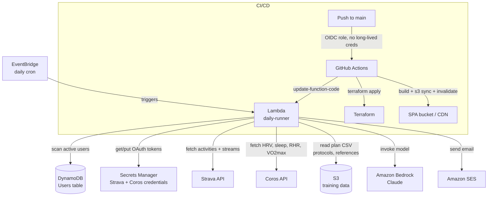
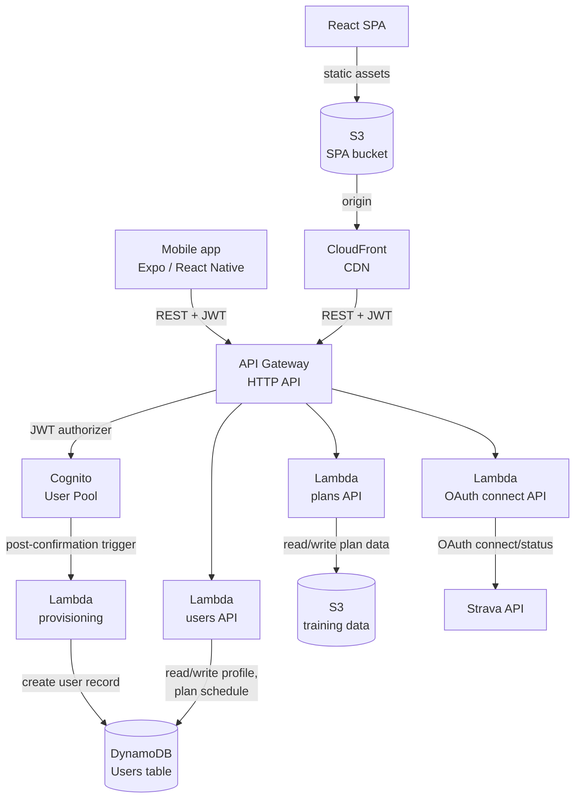

# AI-Personalized Training Tracker

By **Nicholas Willard** — [GitHub](https://github.com/kwiknick) · [LinkedIn](https://linkedin.com/in/nicholas-willard)

A serverless AWS system that turns raw fitness telemetry into a daily, personalized coaching briefing — and a companion web/mobile app for managing the plan behind it. This repo documents the architecture and engineering decisions; the production source is private because it processes personal health and fitness data.

Every morning, the system pulls an athlete's recent activity data from **Strava**, layers in readiness data from a **Coros** watch, maps the date to the correct workout in a multi-race training plan, runs a fitness/fatigue analysis, and asks a Claude model — grounded in that athlete's real data plus curated reference material — to write a structured HTML briefing: pace targets, fueling guidance, and a 7-day training audit. A React web app and a React Native mobile app give the athlete self-service control over the plan and integrations without waiting for the next scheduled run.

See **[AI-DESIGN.md](./AI-DESIGN.md)** for a deep dive on the prompt-engineering and LLM-reliability approach.

---

## Architecture

### Daily briefing pipeline

### Web & mobile app

---

## What this demonstrates

**AWS services in production use, not just tutorials:**

- **Lambda** — one scheduled batch job (daily briefing generation) and four request/response API functions (users, plans, OAuth, post-signup provisioning), sharing patterns but deployed and scaled independently
- **DynamoDB** — single-table user store keyed for the app's actual access patterns (profile lookup, active-user scan for the daily job)
- **S3** — versioned, private bucket for structured training data (plan CSVs, protocol docs, reference material), separate from the public SPA bucket
- **Secrets Manager** — Strava/Coros OAuth client credentials and refresh tokens, rotated on every Lambda invocation rather than stored statically
- **Amazon Bedrock** — model invocation with an explicit cost/quality tradeoff (see AI-DESIGN.md)
- **SES** — outbound transactional email with DKIM-verified custom domain sending
- **API Gateway (HTTP API) + Cognito** — JWT-authenticated REST API shared by a web SPA and a mobile app, with a post-confirmation Lambda trigger for account provisioning
- **CloudFront + ACM + Route 53** — CDN-fronted SPA on a custom domain with a security-headers response policy
- **EventBridge** — cron-driven invocation for the daily pipeline
- **Terraform + GitHub Actions OIDC** — infrastructure as code, deployed via short-lived federated credentials with no long-lived AWS keys stored in CI

**AI/LLM engineering, briefly** (full detail in [AI-DESIGN.md](./AI-DESIGN.md)):

- Prompt construction from typed, computed data — not free-text — so the model reasons over numbers that were already validated in code
- A deliberate split between content the model is allowed to phrase freely and content that must appear verbatim, handled by *not* asking the model to reproduce it at all
- Model selection driven by a real cost constraint (a daily job run for one to a handful of users, priced in cents/month, not a chat product)

---

## Engineering highlights

**Date-agnostic training plans.** Plan files describe week 1 through week N with no calendar dates. The scheduler anchors week N to a race date and counts backward to derive every other week's calendar range at runtime. The same plan file works for any race date, and multiple plan "segments" can be stacked back-to-back (e.g. a base-building block → a half marathon plan → a 100-mile plan → a multi-day ultra prep block) without any date hardcoding in the data itself.

**OAuth token lifecycle handled as a first-class concern.** Every invocation refreshes the access token and immediately persists the rotated refresh token back to Secrets Manager — not just on expiry — so a missed rotation can never leave the stored credential silently stale.

**Training-load modeling, not just pace math.** Beyond deriving easy/threshold pace from recent heart-rate data, the analyzer computes a TRIMP-based training load (elevation-adjusted) and rolls it into fitness/fatigue/form (CTL/ATL/TSB) metrics, with phase detection and overreach-signal flags that feed directly into the day's coaching narrative and can trigger automatic plan adjustments.

**Schedule auditing with anomaly detection.** A 7-day rolling audit maps every planned workout to its calendar date, matches it against what was actually recorded, and flags specific failure modes (HR too high on an easy day, a long run that came up short, activity on a scheduled rest day) rather than just reporting compliance as a percentage.

**Two clients, one backend, no duplication.** The web SPA and the mobile app are separate codebases hitting the identical Cognito-authenticated API — the backend has no knowledge of which client is calling it.

---

## Cost

Running for a single active user, the full system — daily Lambda job, API layer, web app hosting, LLM inference, and email delivery — costs roughly **$1/month**, dominated by Bedrock token usage and a fixed Secrets Manager per-secret charge. Every other component runs at or near AWS free-tier levels at this scale.

---

*This is a companion showcase repo. The production source code, training plan data, and infrastructure configuration are kept in a private repository because the system processes personal health and fitness data. This repo documents the architecture and engineering decisions only — no application code, credentials, or personal data are included here.*

---

**Nicholas Willard** — [github.com/kwiknick](https://github.com/kwiknick) · [linkedin.com/in/nicholas-willard](https://linkedin.com/in/nicholas-willard)
