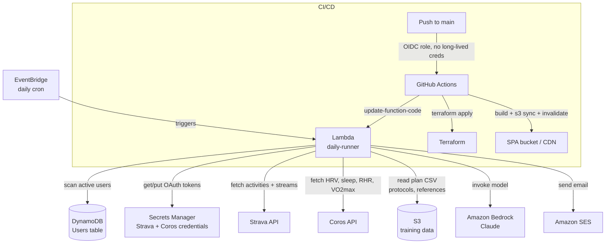
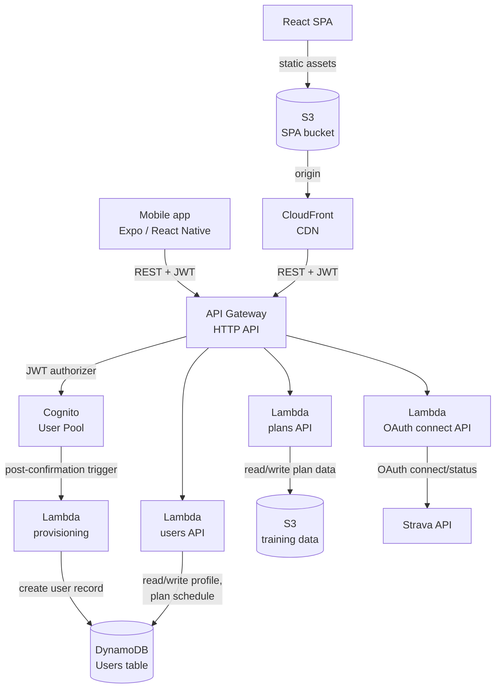

# AI-Personalized Training Tracker

By **Nicholas Willard**. [GitHub](https://github.com/kwiknick) · [LinkedIn](https://linkedin.com/in/nicholas-willard)

A serverless AWS system turns raw fitness telemetry into a daily, personalized coaching briefing. A companion web app and mobile app manage the plan behind it. This repo documents the architecture and the engineering decisions. The production source stays private, because the system processes personal health and fitness data.

Every morning, the system pulls the athlete's recent activity data from **Strava** and adds readiness data from a **Coros** watch. The system maps the date to the correct workout in a multi-race training plan, runs a fitness and fatigue analysis, and asks a Claude model to write a structured HTML briefing. The model works from the athlete's real data plus curated reference material. The briefing covers pace targets, fueling guidance, and a 7-day training audit. A React web app and a React Native mobile app give the athlete self-service control over the plan and integrations, without waiting for the next scheduled run.

Read **[AI-DESIGN.md](./AI-DESIGN.md)** for the prompt-engineering and LLM-reliability approach in detail.

---

## Architecture

### Daily briefing pipeline

### Web & mobile app

---

## What this demonstrates

**AWS services used in production:**

- **Lambda**: one scheduled batch job (daily briefing generation) and four request/response API functions (users, plans, OAuth, post-signup provisioning), sharing patterns but deployed and scaled independently
- **DynamoDB**: single-table user store keyed for the app's actual access patterns (profile lookup, active-user scan for the daily job)
- **S3**: versioned, private bucket for structured training data (plan CSVs, protocol docs, reference material), separate from the public SPA bucket
- **Secrets Manager**: Strava/Coros OAuth client credentials and refresh tokens, rotated on every Lambda invocation rather than stored statically
- **Amazon Bedrock**: model invocation with an explicit cost/quality tradeoff (see AI-DESIGN.md)
- **SES**: outbound transactional email with DKIM-verified custom domain sending
- **API Gateway (HTTP API) + Cognito**: JWT-authenticated REST API shared by a web SPA and a mobile app, with a post-confirmation Lambda trigger for account provisioning
- **CloudFront + ACM + Route 53**: CDN-fronted SPA on a custom domain with a security-headers response policy
- **EventBridge**: cron-driven invocation for the daily pipeline
- **Terraform + GitHub Actions OIDC**: infrastructure as code, deployed via short-lived federated credentials with no long-lived AWS keys stored in CI

**AI and LLM engineering** (details in [AI-DESIGN.md](./AI-DESIGN.md)):

- Prompt construction from typed, computed data, not free text. The model reasons over numbers already validated in code.
- A clean split between content the model can phrase freely and content that must appear word for word. The pipeline never asks the model to write the second kind, and splices it into the output in code afterward.
- Model selection driven by a real cost constraint: a daily job run for one to a handful of users, priced in cents per month, not a chat product.

---

## Engineering highlights

**Date-agnostic training plans.** Plan files describe week 1 through week N with no calendar dates. The scheduler anchors week N to a race date and counts backward to derive every other week's calendar range at runtime. The same plan file works for any race date, and multiple plan "segments" can stack back-to-back (for example, a base-building block, a half marathon plan, a 100-mile plan, and a multi-day ultra prep block) without any date hardcoding in the data itself.

**OAuth tokens rotate on every run.** Each invocation refreshes the access token and writes the new refresh token back to Secrets Manager right away, not only at expiry. A missed rotation can never leave the stored credential stale.

**Training load, not only pace math.** The analyzer derives easy and threshold pace from recent heart-rate data. It also computes a training load score for every activity, adjusted for elevation gain, and rolls the scores into fitness, fatigue, and form metrics (CTL, ATL, TSB). Phase detection and overreach flags feed straight into the day's coaching narrative and can trigger automatic plan adjustments.

> **TRIMP, explained simply**
>
> TRIMP stands for training impulse. One TRIMP score captures how hard an effort was and how long it lasted, combined into a single number. A short, brutal interval session and a long, easy run can rack up a similar total score.
>
> The pipeline adds up your TRIMP scores over time and splits the total into three numbers:
>
> - **CTL (fitness)**: your rolling six-week average load. Higher means fitter.
> - **ATL (fatigue)**: your rolling one-week average load. Higher means more tired right now.
> - **TSB (form)**: CTL minus ATL. Positive means fresh. Negative means fatigued.
>
> Coaches use these three numbers to answer one question: ready for harder work, or due for rest first? [Read more on Wikipedia](https://en.wikipedia.org/wiki/Training_impulse).

**Schedule audits catch specific failures.** A 7-day rolling audit maps every planned workout to its calendar date and checks it against what got recorded. The audit flags specific failure modes: HR too high on an easy day, a long run that came up short, activity on a scheduled rest day. The audit goes beyond a single compliance percentage.

**One backend, two clients.** The web app and the mobile app are separate codebases. Both hit the same Cognito-authenticated API, and the backend never knows which client is calling.

---

## Cost

For a single active user, the full system costs roughly **$1 per month**, covering the daily Lambda job, the API layer, web app hosting, LLM inference, and email delivery. Bedrock token usage and a fixed Secrets Manager per-secret charge account for most of the cost. Every other component runs at or near AWS free-tier levels at this scale.

---

*This is a companion showcase repo. The production source code, training plan data, and infrastructure configuration stay in a private repository, because the system processes personal health and fitness data. This repo documents the architecture and the engineering decisions only. No application code, credentials, or personal data live here.*

---

**Nicholas Willard**. [github.com/kwiknick](https://github.com/kwiknick) · [linkedin.com/in/nicholas-willard](https://linkedin.com/in/nicholas-willard)
